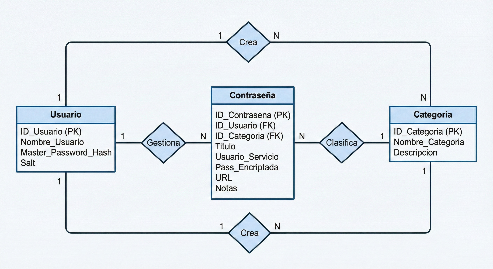

# Password Manager

## Descripción
Este proyecto consiste en el desarrollo de una aplicación de escritorio tipo *password manager*, cuyo objetivo es permitir a los usuarios almacenar y gestionar contraseñas de forma segura. La aplicación utiliza una contraseña maestra para autenticar al usuario y aplicar técnicas de cifrado antes de almacenar la información en una base de datos local.

El sistema está diseñado bajo una arquitectura por capas, separando la interfaz gráfica, la lógica de negocio y el acceso a datos, con el fin de mejorar la organización, seguridad y mantenimiento del proyecto.

---

## Motivación
La motivación principal de este proyecto es aplicar los conocimientos adquiridos sobre bases de datos, programación orientada a objetos y seguridad informática, específicamente en el manejo seguro de información sensible como contraseñas. Además, el proyecto busca simular un caso de uso real utilizado en aplicaciones modernas.

---

## Tech Stack
- Lenguaje: C#
- Framework: .NET
- Interfaz gráfica: WPF
- Base de datos: SQLite
- Control de versiones: Git y GitHub

---

## Diagramas

- Diagrama Entidad-Relacion
!

- Diagrama Entidad-Relacion en UML

